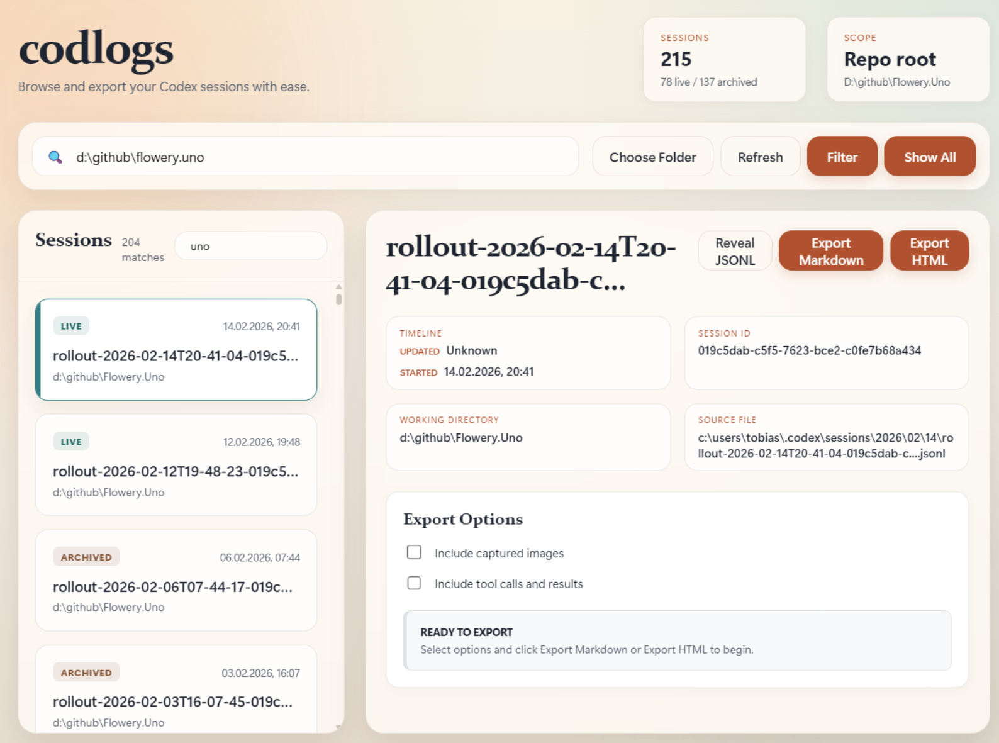
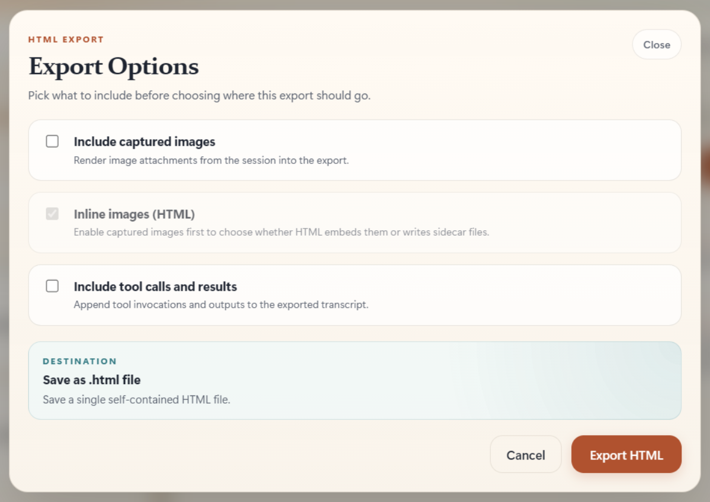

<p align="center">
  
</p>

<p align="center">
  
  
  
  
  
</p>

# codlogs

`codlogs` is a read-only Codex session tool with two entry points:

- a global CLI for finding sessions and exporting one `.jsonl` session to Markdown or HTML
- an Electrobun desktop browser for scanning sessions, filtering by folder, and exporting the selected session to `.md` or `.html`

Planning and investigation artifacts for this repo live under `devlog/YYYY-MM-DD/`.

This repository uses Bun as its development package manager and commits `bun.lock`.
If you are working in this repo, use `bun install` instead of `npm install` or `pnpm install`.

<p align="center">
  
</p>

## CLI

Install it globally from this folder:

```powershell
npm install -g d:\github\codlogs
```

Use either `codlogs` or `codlogs-sessions`:

```powershell
codlogs
codlogs --json
codlogs --help
codlogs d:\github\myDUDreamTool
codlogs /mnt/d/github/myDUDreamTool
codlogs --md C:\Users\tobitege\.codex\sessions\2026\03\06\session.jsonl
codlogs --html C:\Users\tobitege\.codex\sessions\2026\03\06\session.jsonl
codlogs --md C:\Users\tobitege\.codex\sessions\2026\03\06\session.jsonl --include-images --include-tool-results
```

Notes:

- the folder argument is optional; if omitted, the current working directory is used
- if the folder is inside a git repo, the CLI matches sessions for the repo root by default
- use `--json` to print machine-readable session results
- use `-h` or `--help` to show the built-in CLI help text
- use `--cwd-only` to match only the folder tree you pass in
- use `--codex-home PATH` if your Codex data lives somewhere other than `%CODEX_HOME%` or `~/.codex`
- use `--include-images` with `--md` or `--html` to write embedded images into a sibling `.assets` folder
- use `--html` to export a session as an HTML transcript; with `--include-images`, codlogs writes a sibling `.assets` folder
- use `--include-tool-results` with `--md` or `--html` to include tool calls and tool outputs in the export
- Windows drive paths, WSL `/mnt/<drive>/...` paths, and WSL UNC paths are treated as aliases of the same repo

## Desktop App

The desktop browser uses [Electrobun](https://electrobun.dev/).

Prerequisites:

- Bun `>=1.3.12`
- Windows 11+ with WebView2 available for the embedded webview runtime

Run it locally:

```powershell
bun install
bun run start
```

For live UI reload while editing:

```powershell
bun run dev:hmr
```

Other useful commands:

```powershell
bun run build:web
bun run build
```

Notes:

- `bun run start` is the easiest local launch path because it builds the web assets first
- the first Electrobun run downloads its platform-specific core binaries
- the app defaults to the current folder tree on launch

Current desktop app highlights:

- scans live and archived Codex sessions from `~/.codex` or `%CODEX_HOME%`
- filters by current folder tree or repo root and can include cross-session writes
- exports the selected session to Markdown or HTML
- shows a collapsible environment status section for:
  - Codex home read/write access
  - `git` availability
  - `rg` availability
- lets you rename a session title directly from the session list
  - titles are written back to Codex `session_index.jsonl`
  - Codex uses that file as the visible thread-name source of truth
- each session card has a chat replay button that opens a full-window session browser dialog
  - read-only transcript view; nothing is executed
  - searchable with `Ctrl+F`, copyable per entry or with `Copy All`
  - can hide or show tool calls and tool outputs
  - skips `developer` messages and the first bootstrap user message to match the export view
  - truncates very large transcripts at a fixed entry limit and reports skipped oversized rows

## Large Session Handling

codlogs is built to stay usable even when a Codex session file becomes very large.

Current behavior:

- probes session file size without loading the whole file into memory
- uses bounded JSONL scanning for browsing and detail inspection
- skips automatic deep analysis for very large sessions to keep the UI responsive
- surfaces explicit analysis states in the desktop app such as `Full`, `Partial`, and `Skipped`
- offers `Analyze Anyway` for a bounded manual scan when automatic analysis is skipped
- treats oversized JSONL rows as partial-analysis conditions instead of crashing normal inspection
- streams Markdown and HTML export so large session files do not require whole-file reads during export

Practical effect:

- browsing large session folders stays responsive
- selecting a very large session remains safe by default
- export still works for large sessions, but may take longer than normal
- sanitization is optional and separate from the normal large-session browsing/export path

## Session Sanitization

The desktop app includes a `Sanitize Session...` action for producing a derived, smaller JSONL from a large Codex session without modifying the source file.

Current sanitization behavior:

- rewrites the source JSONL line by line and preserves original row order
- preserves opaque `response_item` compaction rows
- preserves rollout-level `type: "compacted"` rows in place
- strips image payloads from normal response rows, `event_msg` user messages, and compacted `replacement_history`
- can optionally use `Strip all blobs` to remove large tool payloads, encrypted reasoning blobs, token-count payloads, and bulky turn-context payloads
- never uses aggressive blob stripping inside `type: "compacted"` replacement history

Sanitize modal options:

- `Create new JSONL copy file`
  - writes `sanitized-session.jsonl` plus `sanitization-report.json` into a fresh temp folder under `%TEMP%\\codlogs\\sanitized-sessions\\...`
- `Strip all blobs`
  - shrinks the output further, but is more aggressive and therefore more compatibility-risky than image stripping alone
- `Re-add session to current day`
  - writes an additional canonical Codex session file into `.../.codex/sessions/YYYY/MM/DD/`
  - uses the default Codex rollout naming convention: `rollout-YYYY-MM-DDThh-mm-ss-<thread-id>.jsonl`
  - generates a fresh UUIDv7-style thread ID and writes that same ID into both the filename and `session_meta.id`
  - also appends the chosen chat name to Codex `session_index.jsonl` so the re-added session appears with a readable title

Title handling:

- the sanitize modal includes a `Chat name` field for `Re-add session to current day`
- session renaming and sanitize re-add use the same shared title sanitizer
- title input is normalized before writing:
  - trims and collapses whitespace
  - strips control characters and bidi-control markers
  - caps the stored title length

Compatibility notes:

- the source session is only read, never modified
- sanitized output is derived, not byte-for-byte identical to the original
- preserving both opaque compaction rows and `type: "compacted"` rows is intentional because Codex resume compatibility depends on them
- after a successful sanitize run, the desktop UI refreshes the session list automatically
